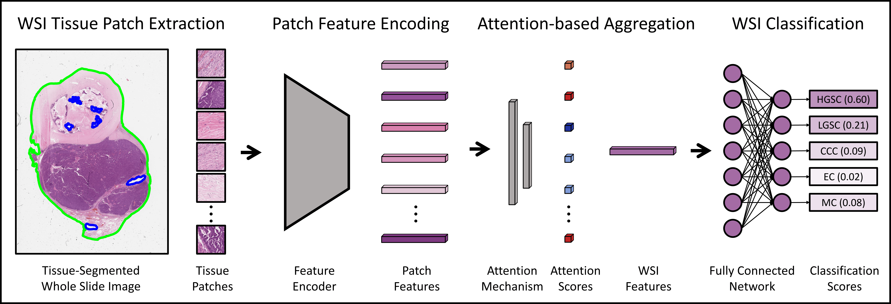
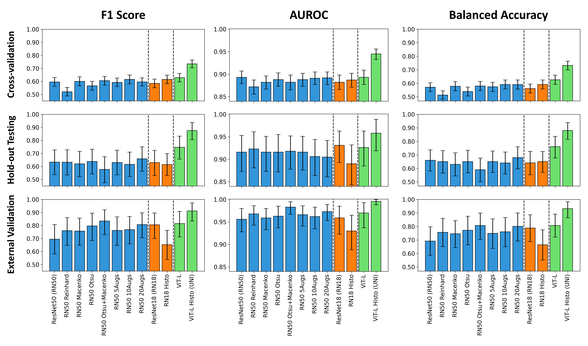

## Histopathology Foundation Models Enable Accurate Ovarian Cancer Subtype Classification


*An extensive analysis of feature extraction techniques in attention-based multiple instance learning ([ABMIL](https://proceedings.mlr.press/v80/ilse18a.html?ref=https://githubhelp.com))* 



Ovarian cancer histological subtype classification using a total of 12 feature extraction techniques. This includes:
- Three feature extraction model architectures (ResNet50, ResNet18, ViT-L)
- Three pretraining strategies (ImageNet, Histo-ResNet18 with SimCLR, Histo-ViT ('UNI') with DINOv2)
- Two normalisation strategies (Reinhard Normalisation, Macenko Normalisation)
- Three quantities of colour-augmented training data (5x, 10x, 20x) 
- Two tissue segmentation strategies (CLAM-default saturation thresholding, Otsu saturation thresholding)

## Hyperparameters
Final Hyperparamters Determined by Hyperparameter Tuning: 
| Model | Learning Rate | Weight Decay | First Moment Decay | Second Moment Decay | Stability Parameter | Model Size | Dropout | Max Patches | LR Decay Factor | LR Decay Patience | 
| :-------: | :-------------: | :------------: |:------------------:|:-------------------: | :-------------------: | :--------------------: | :-------: | :-----------: | :-----------: | :-----------: |
| ResNet50 (RN50) | 2e-3 | 1e-3 | 0.75 | 0.95 | 1e-2 | 20 | 0.75 | [512,128] | 0.4 | 800 | 
| RN50 Reinhard  | 2e-3 | 1e-3 | 0.75 | 0.95 | 1e-2 | 25 | 0.75 | [512,256] | 0.4 | 400 | 
| RN50 Macenko | 2e-3 | 1e-3 | 0.85 | 0.95 | 1e-2 | 15 | 0.75 | [512,128] | 0.3 | 400 | 
| RN50 Otsu | 2e-3 | 1e-3 | 0.75 | 0.95 | 1e-2 | 15 | 0.9 | [512,256] | 0.1 | 600 | 
| RN50 Otsu+Macenko | 2e-3 | 1e-4 | 0.75 | 0.99 | 1e-3 | 25 |  0.9 | [512,256] | 0.3 | 1000 | 
| RN50 5Augs | 1e-3 | 1e-4 | 0.8 | 0.99 | 1e-4 | 25 | 0.6 | [128,32] | 0.4 | 700 | 
| RN50 10Augs | 2e-3 | 1e-3 | 0.8 | 0.99 | 1e-2 | 20 | 0.75 | [512,256] | 0.4 | 700 | 
| RN50 20 Augs | 2e-3 | 1e-4 | 0.7 | 0.999 | 1e-3 | 20 | 0.75 | [512,128] | 0.6 | 1000 | 
| ResNet18 (RN18) | 1e-4 | 1e-5 | 0.8 | 0.99 | 1e-4 | 20 | 0.9 | [1024,256] | 0.5 | 700 | 
| RN18 Histo | 2e-4 | 1e-4 | 0.9 | 0.99 | 1e-4 | 20 | 0.9 | [512,512] | 0.6 | 1000 | 
| ViT | 5e-5 | 1e-1 | 0.85 | 0.999 | 1e-3 | 10 | 0.35 | [512,384] | 0.0 | 800 | 
| ViT Histo | 1e-5 | 1e-3 | 0.9 | 0.999 | 1e-5 | 10 | 0.75 | [512,256] | 0.0 | 1000 | 


Hyperparameters were tuned in 19 stages in which 1-5 individual hyperparameters were altered and the rest were frozen. All specific configurations can be accessed in the folder tuning_configs. The tuning patience was set to 20 for stages 1-7.1, and 30 for stages 7.2-19. The overall maximum epochs was 300 for every evaluation.

<details>
<summary>
Hyperparameter Tuning Stages
</summary>
An issue with unstable random seeds effected some early experiments, but this was resolved before tuning stage 11 for each model. Models which were not effected by this were not subject to tuning stages 11 and 12, which repeated previous models using fixed random seeds.

- Stage 1: Learning Rate, Model Size
- Stage 2: Dropout, Max Patches
- Stage 3: First Moment Decay, Second Moment Decay
- Stage 4: Weight Decay, Learning Rate
- Stage 5: First Moment Decay, Stability Parameter
- Stage 6: Model Size, Max Patches
- Stage 7: LR Decay Factor, LR Decay Patience
- Stage 8: Learning Rate, Dropout
- Stage 9: Model Size
- Stage 10: Learning Rate, Model Size, LR Decay Patience
- Stage 11: Repeat of stage 10 with fixed random seeds
- Stage 12: Repeat of best from first 9 stages with fixed random seeds
- Stage 13: Dropout, Max Patches
- Stage 14: LR Decay Factor, LR Decay Patience
- Stage 15: Learning Rate, Model Size
- Stage 16: Max Patches, Weight Decay
- Stage 17: Model Size
- Stage 18: First Moment Decay, Second Moment Decay
- Stage 19: Learning Rate, First Moment Decay, Model Size, Dropout, Max Patches  


</details>

## Results

Five-class ovarian cancer subtype classification results from three validations. Stratified 5-fold cross-validation used all available training data (1864 WSIs from 434 patients). Independent hold-out testing and external validation used an ensemble of the five cross-validation models. Hold-out testing was performed using 100 WSIs from 30 patients, and external validation was performed using 80 WSIs from 80 patients from the [Transcanadian Study](https://www.medicalimageanalysis.com/data/ovarian-carcinomas-histopathology-dataset). 



<details>
<summary>
Confusion Matrices
</summary>


<details>
<summary>
ResNet50 Baseline Cross-Validation
</summary>

|  | HGSC | LGSC |  CCC | EC | MC |
| :----------: | :----------: | :----------: | :----------: | :----------: | :----------: |
| HGSC | **1175** | 19 | 25 | 37 | 10 |
| LGSC | 62 | **22** | 2 | 4 | 2 |
| CCC | 60 | 4 | **120** | 6 | 8 |
| EC | 48 | 4 | 1 | **131** | 25 |
| MC | 8 | 0 | 6 | 40 | **45** |

class 0 precision: 0.86844 recall: 0.92812 f1: 0.89729

class 1 precision: 0.44898 recall: 0.23913 f1: 0.31206

class 2 precision: 0.77922 recall: 0.60606 f1: 0.68182

class 3 precision: 0.60092 recall: 0.62679 f1: 0.61358

class 4 precision: 0.50000 recall: 0.45455 f1: 0.47619

</details>

<details>
<summary>
ResNet50 Baseline Hold-out Testing
</summary>

|  | HGSC | LGSC |  CCC | EC | MC |
| :----------: | :----------: | :----------: | :----------: | :----------: | :----------: |
| HGSC | **20** | 0 | 0 | 0 | 0 |
| LGSC | 6 | **6** | 0 | 4 | 4 |
| CCC | 9 | 2 | **8** | 1 | 0 |
| EC | 3 | 0 | 0 | **17** | 0 |
| MC | 3 | 0 | 2 | 0 | **15** |

class 0 precision: 0.48780 recall: 1.00000 f1: 0.65574

class 1 precision: 0.75000 recall: 0.30000 f1: 0.42857

class 2 precision: 0.80000 recall: 0.40000 f1: 0.53333

class 3 precision: 0.77273 recall: 0.85000 f1: 0.80952

class 4 precision: 0.78947 recall: 0.75000 f1: 0.76923

</details>


<details>
<summary>
ResNet50 Baseline External Validation
</summary>

|  | HGSC | LGSC |  CCC | EC | MC |
| :----------: | :----------: | :----------: | :----------: | :----------: | :----------: |
| HGSC | **26** | 0 | 0 | 4 | 0 |
| LGSC | 7 | **2** | 0 | 0 | 0 |
| CCC | 2 | 1 | **17** | 0 | 0 |
| EC | 2 | 0 | 0 | **9** | 0 |
| MC | 0 | 0 | 0 | 3 | **7** |

class 0 precision: 0.70270 recall: 0.86667 f1: 0.77612

class 1 precision: 0.66667 recall: 0.22222 f1: 0.33333

class 2 precision: 1.00000 recall: 0.85000 f1: 0.91892

class 3 precision: 0.56250 recall: 0.81818 f1: 0.66667

class 4 precision: 1.00000 recall: 0.70000 f1: 0.82353

</details>

<details>
<summary>
ResNet50 Reinhard Normalised Cross-Validation
</summary>

|  | HGSC | LGSC |  CCC | EC | MC |
| :----------: | :----------: | :----------: | :----------: | :----------: | :----------: |
| HGSC | **1158** | 8 | 60 | 25 | 15 |
| LGSC | 70 | **13** | 5 | 1 | 3 |
| CCC | 56 | 5 | **126** | 0 | 11 |
| EC | 54 | 8 | 3 | **89** | 55 |
| MC | 11 | 0 | 8 | 36 | **44** |


</details>

<details>
<summary>
ResNet50 Reinhard Normalised Hold-out Testing
</summary>

|  | HGSC | LGSC |  CCC | EC | MC |
| :----------: | :----------: | :----------: | :----------: | :----------: | :----------: |
| HGSC | **20** | 0 | 0 | 0 | 0 |
| LGSC | 7 | **6** | 0 | 3 | 4 |
| CCC | 9 | 1 | **10** | 0 | 0 |
| EC | 5 | 1 | 0 | **13** | 1 |
| MC | 2 | 0 | 2 | 0 | **16** |


</details>


<details>
<summary>
ResNet50 Reinhard Normalised External Validation
</summary>

|  | HGSC | LGSC |  CCC | EC | MC |
| :----------: | :----------: | :----------: | :----------: | :----------: | :----------: |
| HGSC | **25** | 0 | 2 | 3 | 0 |
| LGSC | 4 | **4** | 1 | 0 | 0 |
| CCC | 3 | 1 | **16** | 0 | 0 |
| EC | 1 | 0 | 0 | **10** | 0 |
| MC | 0 | 0 | 0 | 2 | **8** |

class 0 precision: 0.75758 recall: 0.83333 f1: 0.79365

class 1 precision: 0.80000 recall: 0.44444 f1: 0.57143

class 2 precision: 0.84211 recall: 0.80000 f1: 0.82051

class 3 precision: 0.66667 recall: 0.90909 f1: 0.76923

class 4 precision: 1.00000 recall: 0.80000 f1: 0.88889

</details>

<details>
<summary>
ResNet50 Macenko Normalised Cross-Validation
</summary>

|  | HGSC | LGSC |  CCC | EC | MC |
| :----------: | :----------: | :----------: | :----------: | :----------: | :----------: |
| HGSC | **1154** | 23 | 50 | 33 | 6 |
| LGSC | 55 | **31** | 1 | 3 | 2 |
| CCC | 68 | 3 | **120** | 1 | 6 |
| EC | 48 | 9 | 1 | **130** | 21 |
| MC | 9 | 1 | 7 | 41 | **41** |

class 0 precision: 0.86507 recall: 0.91153 f1: 0.88769

class 1 precision: 0.46269 recall: 0.33696 f1: 0.38994

class 2 precision: 0.67039 recall: 0.60606 f1: 0.63660

class 3 precision: 0.62500 recall: 0.62201 f1: 0.62350

class 4 precision: 0.53947 recall: 0.41414 f1: 0.46857

</details>

<details>
<summary>
ResNet50 Macenko Normalised Hold-out Testing
</summary>

|  | HGSC | LGSC |  CCC | EC | MC |
| :----------: | :----------: | :----------: | :----------: | :----------: | :----------: |
| HGSC | **20** | 0 | 0 | 0 | 0 |
| LGSC | 7 | **7** | 0 | 4 | 2 |
| CCC | 10 | 1 | **9** | 0 | 0 |
| EC | 4 | 2 | 0 | **14** | 0 |
| MC | 5 | 0 | 2 | 0 | **13** |

class 0 precision: 0.43478 recall: 1.00000 f1: 0.60606

class 1 precision: 0.70000 recall: 0.35000 f1: 0.46667

class 2 precision: 0.81818 recall: 0.45000 f1: 0.58065

class 3 precision: 0.77778 recall: 0.70000 f1: 0.73684

class 4 precision: 0.86667 recall: 0.65000 f1: 0.74286

</details>


<details>
<summary>
ResNet50 Macenko Normalised External Validation
</summary>

|  | HGSC | LGSC |  CCC | EC | MC |
| :----------: | :----------: | :----------: | :----------: | :----------: | :----------: |
| HGSC | **29** | 0 | 0 | 1 | 0 |
| LGSC | 6 | **3** | 0 | 0 | 0 |
| CCC | 2 | 2 | **16** | 0 | 0 |
| EC | 2 | 0 | 0 | **8** | 1 |
| MC | 0 | 0 | 0 | 1 | **9** |

class 0 precision: 0.74359 recall: 0.96667 f1: 0.84058

class 1 precision: 0.60000 recall: 0.33333 f1: 0.42857

class 2 precision: 1.00000 recall: 0.80000 f1: 0.88889

class 3 precision: 0.80000 recall: 0.72727 f1: 0.76190

class 4 precision: 0.90000 recall: 0.90000 f1: 0.90000

</details>


<details>
<summary>
ResNet50 Otsu Thresholding Cross-Validation
</summary>

|  | HGSC | LGSC |  CCC | EC | MC |
| :----------: | :----------: | :----------: | :----------: | :----------: | :----------: |
| HGSC | **1169** | 28 | 23 | 34 | 12 |
| LGSC | 62 | **25** | 1 | 2 | 2 |
| CCC | 73 | 4 | **113** | 3 | 5 |
| EC | 55 | 2 | 5 | **116** | 31 |
| MC | 10 | 0 | 7 | 45 | **37** |

class 0 precision: 0.85391 recall: 0.92338 f1: 0.88729

class 1 precision: 0.42373 recall: 0.27174 f1: 0.33113

class 2 precision: 0.75839 recall: 0.57071 f1: 0.65130

class 3 precision: 0.58000 recall: 0.55502 f1: 0.56724

class 4 precision: 0.42529 recall: 0.37374 f1: 0.39785

</details>

<details>
<summary>
ResNet50 Otsu Thresholding Hold-out Testing
</summary>

|  | HGSC | LGSC |  CCC | EC | MC |
| :----------: | :----------: | :----------: | :----------: | :----------: | :----------: |
| HGSC | **20** | 0 | 0 | 0 | 0 |
| LGSC | 6 | **9** | 0 | 3 | 2 |
| CCC | 10 | 3 | **7** | 0 | 0 |
| EC | 3 | 1 | 0 | **16** | 0 |
| MC | 5 | 0 | 2 | 0 | **13** |

class 0 precision: 0.45455 recall: 1.00000 f1: 0.62500

class 1 precision: 0.69231 recall: 0.45000 f1: 0.54545

class 2 precision: 0.77778 recall: 0.35000 f1: 0.48276

class 3 precision: 0.84211 recall: 0.80000 f1: 0.82051

class 4 precision: 0.86667 recall: 0.65000 f1: 0.74286


</details>


<details>
<summary>
ResNet50 Otsu Thresholding External Validation
</summary>

|  | HGSC | LGSC |  CCC | EC | MC |
| :----------: | :----------: | :----------: | :----------: | :----------: | :----------: |
| HGSC | **30** | 0 | 0 | 0 | 0 |
| LGSC | 5 | **4** | 0 | 0 | 0 |
| CCC | 3 | 1 | **16** | 0 | 0 |
| EC | 2 | 0 | 0 | **9** | 0 |
| MC | 0 | 0 | 0 | 2 | **8** |

class 0 precision: 0.75000 recall: 1.00000 f1: 0.85714

class 1 precision: 0.80000 recall: 0.44444 f1: 0.57143

class 2 precision: 1.00000 recall: 0.80000 f1: 0.88889

class 3 precision: 0.81818 recall: 0.81818 f1: 0.81818

class 4 precision: 1.00000 recall: 0.80000 f1: 0.88889

</details>


<details>
<summary>
ResNet50 Otsu+Macenko Cross-Validation
</summary>

|  | HGSC | LGSC |  CCC | EC | MC |
| :----------: | :----------: | :----------: | :----------: | :----------: | :----------: |
| HGSC | **1163** | 34 | 33 | 32 | 4 |
| LGSC | 54 | **29** | 6 | 2 | 1 |
| CCC | 69 | 3 | **118** | 3 | 5 |
| EC | 50 | 6 | 2 | **127** | 24 |
| MC | 12 | 1 | 3 | 37 | **46** |

class 0 precision: 0.86276 recall: 0.91864 f1: 0.88982

class 1 precision: 0.39726 recall: 0.31522 f1: 0.35152

class 2 precision: 0.72840 recall: 0.59596 f1: 0.65556

class 3 precision: 0.63184 recall: 0.60766 f1: 0.61951

class 4 precision: 0.57500 recall: 0.46465 f1: 0.51397

</details>

<details>
<summary>
ResNet50 Otsu+Macenko Hold-out Testing
</summary>

|  | HGSC | LGSC |  CCC | EC | MC |
| :----------: | :----------: | :----------: | :----------: | :----------: | :----------: |
| HGSC | **20** | 0 | 0 | 0 | 0 |
| LGSC | 8 | **7** | 0 | 3 | 2 |
| CCC | 9 | 2 | **9** | 0 | 0 |
| EC | 4 | 2 | 0 | **14** | 0 |
| MC | 7 | 0 | 2 | 2 | **9** |

class 0 precision: 0.41667 recall: 1.00000 f1: 0.58824

class 1 precision: 0.63636 recall: 0.35000 f1: 0.45161

class 2 precision: 0.81818 recall: 0.45000 f1: 0.58065

class 3 precision: 0.73684 recall: 0.70000 f1: 0.71795

class 4 precision: 0.81818 recall: 0.45000 f1: 0.58065

</details>


<details>
<summary>
ResNet50 Otsu+Macenko External Validation
</summary>

|  | HGSC | LGSC |  CCC | EC | MC |
| :----------: | :----------: | :----------: | :----------: | :----------: | :----------: |
| HGSC | **29** | 0 | 0 | 1 | 0 |
| LGSC | 5 | **4** | 0 | 0 | 0 |
| CCC | 2 | 0 | **18** | 0 | 0 |
| EC | 2 | 0 | 0 | **9** | 0 |
| MC | 1 | 0 | 0 | 0 | **9** |

class 0 precision: 0.74359 recall: 0.96667 f1: 0.84058

class 1 precision: 1.00000 recall: 0.44444 f1: 0.61538

class 2 precision: 1.00000 recall: 0.90000 f1: 0.94737

class 3 precision: 0.90000 recall: 0.81818 f1: 0.85714

class 4 precision: 1.00000 recall: 0.90000 f1: 0.94737

</details>


<details>
<summary>
ResNet50 5Augs Cross-Validation
</summary>

|  | HGSC | LGSC |  CCC | EC | MC |
| :----------: | :----------: | :----------: | :----------: | :----------: | :----------: |
| HGSC | **1144** | 41 | 23 | 51 | 7 |
| LGSC | 56 | **29** | 4 | 2 | 1 |
| CCC | 67 | 6 | **116** | 2 | 7 |
| EC | 53 | 6 | 0 | **121** | 29 |
| MC | 12 | 0 | 4 | 35 | **48** |


</details>

<details>
<summary>
ResNet50 5Augs Hold-out Testing
</summary>

|  | HGSC | LGSC |  CCC | EC | MC |
| :----------: | :----------: | :----------: | :----------: | :----------: | :----------: |
| HGSC | **20** | 0 | 0 | 0 | 0 |
| LGSC | 6 | **7** | 1 | 4 | 2 |
| CCC | 10 | 3 | **7** | 0 | 0 |
| EC | 4 | 0 | 0 | **16** | 0 |
| MC | 3 | 0 | 2 | 0 | **15** |


</details>


<details>
<summary>
ResNet50 5Augs External Validation
</summary>

|  | HGSC | LGSC |  CCC | EC | MC |
| :----------: | :----------: | :----------: | :----------: | :----------: | :----------: |
| HGSC | **28** | 0 | 0 | 2 | 0 |
| LGSC | 4 | **4** | 0 | 1 | 0 |
| CCC | 2 | 1 | **17** | 0 | 0 |
| EC | 2 | 0 | 0 | **9** | 0 |
| MC | 0 | 0 | 0 | 3 | **7** |

class 0 precision: 0.77778 recall: 0.93333 f1: 0.84848

class 1 precision: 0.80000 recall: 0.44444 f1: 0.57143

class 2 precision: 1.00000 recall: 0.85000 f1: 0.91892

class 3 precision: 0.60000 recall: 0.81818 f1: 0.69231

class 4 precision: 1.00000 recall: 0.70000 f1: 0.82353

</details>


<details>
<summary>
ResNet50 10Augs Cross-Validation
</summary>

|  | HGSC | LGSC |  CCC | EC | MC |
| :----------: | :----------: | :----------: | :----------: | :----------: | :----------: |
| HGSC | **1164** | 29 | 25 | 42 | 6 |
| LGSC | 57 | **32** | 1 | 1 | 1 |
| CCC | 55 | 6 | **132** | 5 | 0 |
| EC | 47 | 6 | 1 | **131** | 24 |
| MC | 10 | 0 | 7 | 43 | **39** |

class 0 precision: 0.87322 recall: 0.91943 f1: 0.89573

class 1 precision: 0.43836 recall: 0.34783 f1: 0.38788

class 2 precision: 0.79518 recall: 0.66667 f1: 0.72527

class 3 precision: 0.59009 recall: 0.62679 f1: 0.60789

class 4 precision: 0.55714 recall: 0.39394 f1: 0.46154

</details>

<details>
<summary>
ResNet50 10Augs Hold-out Testing
</summary>

|  | HGSC | LGSC |  CCC | EC | MC |
| :----------: | :----------: | :----------: | :----------: | :----------: | :----------: |
| HGSC | **19** | 0 | 0 | 1 | 0 |
| LGSC | 6 | **7** | 0 | 4 | 3 |
| CCC | 11 | 3 | **6** | 0 | 0 |
| EC | 4 | 0 | 0 | **16** | 0 |
| MC | 2 | 0 | 2 | 0 | **16** |

class 0 precision: 0.45238 recall: 0.95000 f1: 0.61290

class 1 precision: 0.70000 recall: 0.35000 f1: 0.46667

class 2 precision: 0.75000 recall: 0.30000 f1: 0.42857

class 3 precision: 0.76190 recall: 0.80000 f1: 0.78049

class 4 precision: 0.84211 recall: 0.80000 f1: 0.82051

</details>


<details>
<summary>
ResNet50 10Augs External Validation
</summary>

|  | HGSC | LGSC |  CCC | EC | MC |
| :----------: | :----------: | :----------: | :----------: | :----------: | :----------: |
| HGSC | **28** | 0 | 0 | 2 | 0 |
| LGSC | 4 | **5** | 0 | 0 | 0 |
| CCC | 2 | 2 | **16** | 0 | 0 |
| EC | 1 | 1 | 0 | **9** | 0 |
| MC | 0 | 0 | 0 | 3 | **7** |

class 0 precision: 0.80000 recall: 0.93333 f1: 0.86154

class 1 precision: 0.62500 recall: 0.55556 f1: 0.58824

class 2 precision: 1.00000 recall: 0.80000 f1: 0.88889

class 3 precision: 0.64286 recall: 0.81818 f1: 0.72000

class 4 precision: 1.00000 recall: 0.70000 f1: 0.82353

</details>


<details>
<summary>
ResNet50 20Augs Cross-Validation
</summary>

|  | HGSC | LGSC |  CCC | EC | MC |
| :----------: | :----------: | :----------: | :----------: | :----------: | :----------: |
| HGSC | **1125** | 48 | 50 | 40 | 3 |
| LGSC | 53 | **31** | 4 | 2 | 2 |
| CCC | 51 | 10 | **127** | 3 | 7 |
| EC | 46 | 3 | 1 | **126** | 33 |
| MC | 10 | 0 | 5 | 36 | **48** |

class 0 precision: 0.87549 recall: 0.88863 f1: 0.88201

class 1 precision: 0.33696 recall: 0.33696 f1: 0.33696

class 2 precision: 0.67914 recall: 0.64141 f1: 0.65974

class 3 precision: 0.60870 recall: 0.60287 f1: 0.60577

class 4 precision: 0.51613 recall: 0.48485 f1: 0.50000

</details>

<details>
<summary>
ResNet50 20Augs Hold-out Testing
</summary>

|  | HGSC | LGSC |  CCC | EC | MC |
| :----------: | :----------: | :----------: | :----------: | :----------: | :----------: |
| HGSC | **19** | 0 | 0 | 1 | 0 |
| LGSC | 6 | **6** | 1 | 4 | 3 |
| CCC | 6 | 2 | **11** | 1 | 0 |
| EC | 4 | 0 | 0 | **16** | 0 |
| MC | 1 | 0 | 3 | 0 | **16** |

class 0 precision: 0.52778 recall: 0.95000 f1: 0.67857

class 1 precision: 0.75000 recall: 0.30000 f1: 0.42857

class 2 precision: 0.73333 recall: 0.55000 f1: 0.62857

class 3 precision: 0.72727 recall: 0.80000 f1: 0.76190

class 4 precision: 0.84211 recall: 0.80000 f1: 0.82051

</details>


<details>
<summary>
ResNet50 20Augs External Validation
</summary>

|  | HGSC | LGSC |  CCC | EC | MC |
| :----------: | :----------: | :----------: | :----------: | :----------: | :----------: |
| HGSC | **26** | 1 | 1 | 2 | 0 |
| LGSC | 3 | **6** | 0 | 0 | 0 |
| CCC | 2 | 1 | **17** | 0 | 0 |
| EC | 2 | 0 | 0 | **9** | 0 |
| MC | 0 | 0 | 0 | 2 | **8** |

class 0 precision: 0.78788 recall: 0.86667 f1: 0.82540

class 1 precision: 0.75000 recall: 0.66667 f1: 0.70588

class 2 precision: 0.94444 recall: 0.85000 f1: 0.89474

class 3 precision: 0.69231 recall: 0.81818 f1: 0.75000

class 4 precision: 1.00000 recall: 0.80000 f1: 0.88889

</details>

<details>
<summary>
ResNet18 Baseline Cross-Validation
</summary>

|  | HGSC | LGSC |  CCC | EC | MC |
| :----------: | :----------: | :----------: | :----------: | :----------: | :----------: |
| HGSC | **1179** | 37 | 32 | 12 | 6 |
| LGSC | 55 | **32** | 4 | 0 | 1 |
| CCC | 57 | 2 | **137** | 1 | 1 |
| EC | 56 | 7 | 10 | **98** | 38 |
| MC | 18 | 1 | 5 | 39 | **36** |

class 0 precision: 0.86374 recall: 0.93128 f1: 0.89624

class 1 precision: 0.40506 recall: 0.34783 f1: 0.37427

class 2 precision: 0.72872 recall: 0.69192 f1: 0.70984

class 3 precision: 0.65333 recall: 0.46890 f1: 0.54596

class 4 precision: 0.43902 recall: 0.36364 f1: 0.39779

</details>

<details>
<summary>
ResNet18 Baseline Hold-out Testing
</summary>

|  | HGSC | LGSC |  CCC | EC | MC |
| :----------: | :----------: | :----------: | :----------: | :----------: | :----------: |
| HGSC | **20** | 0 | 0 | 0 | 0 |
| LGSC | 6 | **8** | 0 | 2 | 4 |
| CCC | 9 | 3 | **8** | 0 | 0 |
| EC | 6 | 1 | 0 | **13** | 0 |
| MC | 3 | 0 | 2 | 0 | **15** |

class 0 precision: 0.45455 recall: 1.00000 f1: 0.62500

class 1 precision: 0.66667 recall: 0.40000 f1: 0.50000

class 2 precision: 0.80000 recall: 0.40000 f1: 0.53333

class 3 precision: 0.86667 recall: 0.65000 f1: 0.74286

class 4 precision: 0.78947 recall: 0.75000 f1: 0.76923

</details>


<details>
<summary>
ResNet18 Baseline External Validation
</summary>

|  | HGSC | LGSC |  CCC | EC | MC |
| :----------: | :----------: | :----------: | :----------: | :----------: | :----------: |
| HGSC | **28** | 0 | 0 | 2 | 0 |
| LGSC | 5 | **4** | 0 | 0 | 0 |
| CCC | 2 | 1 | **17** | 0 | 0 |
| EC | 2 | 0 | 0 | **9** | 0 |
| MC | 0 | 0 | 0 | 1 | **9** |

class 0 precision: 0.75676 recall: 0.93333 f1: 0.83582

class 1 precision: 0.80000 recall: 0.44444 f1: 0.57143

class 2 precision: 1.00000 recall: 0.85000 f1: 0.91892

class 3 precision: 0.75000 recall: 0.81818 f1: 0.78261

class 4 precision: 1.00000 recall: 0.90000 f1: 0.94737

</details>


<details>
<summary>
ResNet18 Histo Cross-Validation
</summary>

|  | HGSC | LGSC |  CCC | EC | MC |
| :----------: | :----------: | :----------: | :----------: | :----------: | :----------: |
| HGSC | **1165** | 26 | 29 | 43 | 3 |
| LGSC | 54 | **27** | 8 | 1 | 2 |
| CCC | 56 | 3 | **136** | 1 | 2 |
| EC | 56 | 5 | 1 | **121** | 26 |
| MC | 10 | 2 | 7 | 33 | **47** |

class 0 precision: 0.86875 recall: 0.92022 f1: 0.89375

class 1 precision: 0.42857 recall: 0.29348 f1: 0.34839

class 2 precision: 0.75138 recall: 0.68687 f1: 0.71768

class 3 precision: 0.60804 recall: 0.57895 f1: 0.59314

class 4 precision: 0.58750 recall: 0.47475 f1: 0.52514


</details>

<details>
<summary>
ResNet18 Histo Hold-out Testing
</summary>

|  | HGSC | LGSC |  CCC | EC | MC |
| :----------: | :----------: | :----------: | :----------: | :----------: | :----------: |
| HGSC | **19** | 0 | 0 | 1 | 0 |
| LGSC | 9 | **2** | 2 | 4 | 3 |
| CCC | 5 | 1 | **14** | 0 | 0 |
| EC | 6 | 1 | 0 | **13** | 0 |
| MC | 3 | 0 | 0 | 0 | **17** |

class 0 precision: 0.45238 recall: 0.95000 f1: 0.61290

class 1 precision: 0.50000 recall: 0.10000 f1: 0.16667

class 2 precision: 0.87500 recall: 0.70000 f1: 0.77778

class 3 precision: 0.72222 recall: 0.65000 f1: 0.68421

class 4 precision: 0.85000 recall: 0.85000 f1: 0.85000

</details>


<details>
<summary>
ResNet18 Histo External Validation
</summary>

|  | HGSC | LGSC |  CCC | EC | MC |
| :----------: | :----------: | :----------: | :----------: | :----------: | :----------: |
| HGSC | **22** | 0 | 0 | 8 | 0 |
| LGSC | 5 | **4** | 0 | 0 | 0 |
| CCC | 4 | 2 | **14** | 0 | 0 |
| EC | 1 | 0 | 0 | **6** | 4 |
| MC | 0 | 0 | 0 | 1 | **9** |

class 0 precision: 0.68750 recall: 0.73333 f1: 0.70968

class 1 precision: 0.66667 recall: 0.44444 f1: 0.53333

class 2 precision: 1.00000 recall: 0.70000 f1: 0.82353

class 3 precision: 0.40000 recall: 0.54545 f1: 0.46154

class 4 precision: 0.69231 recall: 0.90000 f1: 0.78261


</details>


<details>
<summary>
ViT-L Baseline Cross-validation
</summary>

|  | HGSC | LGSC |  CCC | EC | MC |
| :----------: | :----------: | :----------: | :----------: | :----------: | :----------: |
| HGSC | **1149** | 53 | 27 | 29 | 8 |
| LGSC | 44 | **37** | 4 | 2 | 5 |
| CCC | 51 | 5 | **135** | 1 | 6 |
| EC | 44 | 5 | 0 | **120** | 40 |
| MC | 3 | 1 | 4 | 35 | **56** |


class 0 precision: 0.89001 recall: 0.90758 f1: 0.89871

class 1 precision: 0.36634 recall: 0.40217 f1: 0.38342

class 2 precision: 0.79412 recall: 0.68182 f1: 0.73370

class 3 precision: 0.64171 recall: 0.57416 f1: 0.60606

class 4 precision: 0.48696 recall: 0.56566 f1: 0.52336

</details>


<details>
<summary>
ViT-L Baseline Hold-out Testing
</summary>

|  | HGSC | LGSC |  CCC | EC | MC |
| :----------: | :----------: | :----------: | :----------: | :----------: | :----------: |
| HGSC | **10** | 0 | 0 | 0 | 0 |
| LGSC | 1 | **10** | 2 | 5 | 2 |
| CCC | 5 | 1 | **14** | 0 | 0 |
| EC | 2 | 0 | 0 | **15** | 3 |
| MC | 1 | 0 | 2 | 0 | **17** |

class 0 precision: 0.68966 recall: 1.00000 f1: 0.81633

class 1 precision: 0.90909 recall: 0.50000 f1: 0.64516

class 2 precision: 0.77778 recall: 0.70000 f1: 0.73684

class 3 precision: 0.75000 recall: 0.75000 f1: 0.75000

class 4 precision: 0.77273 recall: 0.85000 f1: 0.80952

</details>


<details>
<summary>
ViT-L Baseline External Validation
</summary>

|  | HGSC | LGSC |  CCC | EC | MC |
| :----------: | :----------: | :----------: | :----------: | :----------: | :----------: |
| HGSC | **28** | 0 | 1 | 1 | 0 |
| LGSC | 4 | **3** | 1 | 1 | 0 |
| CCC | 1 | 0 | **19** | 0 | 0 |
| EC | 2 | 0 | 0 | **9** | 0 |
| MC | 0 | 0 | 0 | 0 | **10** |


class 0 precision: 0.80000 recall: 0.93333 f1: 0.86154

class 1 precision: 1.00000 recall: 0.33333 f1: 0.50000

class 2 precision: 0.90476 recall: 0.95000 f1: 0.92683

class 3 precision: 0.81818 recall: 0.81818 f1: 0.81818

class 4 precision: 1.00000 recall: 1.00000 f1: 1.00000


</details>


  
<details>
<summary>
ViT-L Histo (UNI) Cross-validation
</summary>

|  | HGSC | LGSC |  CCC | EC | MC |
| :----------: | :----------: | :----------: | :----------: | :----------: | :----------: |
| HGSC | **1165** | 46 | 28 | 25 | 2 |
| LGSC | 39 | **43** | 7 | 3 | 0 |
| CCC | 29 | 10 | **154** | 3 | 2 |
| EC | 21 | 4 | 2 | **173** | 9 |
| MC | 1 | 0 | 4 | 28 | **66** |

class 0 precision: 0.92829 recall: 0.92022 f1: 0.92424

class 1 precision: 0.41748 recall: 0.46739 f1: 0.44103

class 2 precision: 0.78974 recall: 0.77778 f1: 0.78372

class 3 precision: 0.74569 recall: 0.82775 f1: 0.78458

class 4 precision: 0.83544 recall: 0.66667 f1: 0.74157

</details>


<details>
<summary>
ViT-L Histo (UNI) Hold-out Testing
</summary>

|  | HGSC | LGSC |  CCC | EC | MC |
| :----------: | :----------: | :----------: | :----------: | :----------: | :----------: |
| HGSC | **18** | 0 | 0 | 2 | 0 |
| LGSC | 0 | **14** | 2 | 2 | 2 |
| CCC | 3 | 0 | **17** | 0 | 0 |
| EC | 1 | 0 | 0 | **19** | 0 |
| MC | 0 | 0 | 0 | 0 | **20** |

class 0 precision: 0.81818 recall: 0.90000 f1: 0.85714

class 1 precision: 1.00000 recall: 0.70000 f1: 0.82353

class 2 precision: 0.89474 recall: 0.85000 f1: 0.87179

class 3 precision: 0.82609 recall: 0.95000 f1: 0.88372

class 4 precision: 0.90909 recall: 1.00000 f1: 0.95238


</details>


<details>
<summary>
ViT-L Histo (UNI) External Validation
</summary>


|  | HGSC | LGSC |  CCC | EC | MC |
| :----------: | :----------: | :----------: | :----------: | :----------: | :----------: |
| HGSC | **27** | 0 | 1 | 2 | 0 |
| LGSC | 0 | **9** | 0 | 0 | 0 |
| CCC | 0 | 1 | **19** | 0 | 0 |
| EC | 0 | 0 | 0 | **10** | 1 |
| MC | 0 | 0 | 0 | 1 | **9** |

class 0 precision: 1.00000 recall: 0.90000 f1: 0.94737

class 1 precision: 0.90000 recall: 1.00000 f1: 0.94737

class 2 precision: 0.95000 recall: 0.95000 f1: 0.95000

class 3 precision: 0.76923 recall: 0.90909 f1: 0.83333

class 4 precision: 0.90000 recall: 0.90000 f1: 0.90000

</details>

</details>

## Code Examples
The following code includes examples from every stage of pre-processing, hyperparameter tuning, and model validation.  

<details>
<summary>
Tissue segmentation and tissue patch extraction 
</summary>
1024x1024 pixel patches at 40x native magnification for internal data and 512x512 at 20x native magnification for external data, so that after downsampling to apparent 10x magnification, patches will be 256x256. 

``` shell
## Internal data with CLAM default segmentation paramters 
python create_patches_fp.py --source "/mnt/data/Katie_WSI/edrive" --save_dir "/mnt/results/patches/ovarian_leeds_mag40x_patch1024_DGX_fp" --patch_size 1024 --step_size 1024 --seg --patch --stitch
## Internal data with Otsu thresholding segmentation and manually adjusted parameters
python create_patches_fp.py --source "/mnt/data/Katie_WSI/edrive" --save_dir "/mnt/results/patches/ovarian_leeds_mag40x_patch1024_DGX_fp_otsu" --patch_size 1024 --step_size 1024 --seg --patch --stitch --max_holes 100 --closing 20 --use_otsu --sthresh 0 --max_holes 20 --mthresh 15	
## External data with CLAM default segmentation parameters
python create_patches_fp.py --source "/mnt/data/transcanadian_WSI" --save_dir "/mnt/results/patches/transcanadian_mag20x_patch512_DGX_fp" --patch_size 512 --step_size 512 --seg --patch --stitch
## External data with Otsu thresholding segmentation and manually adjusted parameters
python create_patches_fp.py --source "/mnt/data/transcanadian_WSI" --save_dir "/mnt/results/patches/transcanadian_mag20x_patch512_DGX_fp_otsu" --patch_size 512 --step_size 512 --seg --patch --stitch --max_holes 100 --closing 20 --use_otsu --sthresh 0 --max_holes 20 --mthresh 15	
``` 
</details>


<details>
<summary>
Patch feature extraction 
</summary>
Feature extraction using 256x256 pixel patches at 10x apparent magnification, with various preprocessing and pretraining techniques, and model archiectures. Code here is for internal data, with the only notable difference in external data being a custom_downsample of 2 rather than 4 given the native 20x magnification rather than the internal 40x. All feature extraction models are ImageNet-pretrained unless explicitly listed as "histo-pretrained".

``` shell
## Baseline ResNet50
python extract_features_fp.py --hardware DGX --custom_downsample 4 --model_type 'resnet50' --data_h5_dir "/mnt/results/patches/ovarian_leeds_mag40x_patch1024_DGX_fp" --data_slide_dir "/mnt/data/Katie_WSI/edrive" --csv_path "dataset_csv/set_edrivepatches_ESGO_train_staging.csv" --feat_dir "/mnt/results/features/ovarian_leeds_resnet50_10x_features_DGX" --batch_size 32 --slide_ext .svs
## Baseline ResNet50 with Otsu thresholding in patch extraction
python extract_features_fp.py --hardware DGX --custom_downsample 4 --model_type 'resnet50' --data_h5_dir "/mnt/results/patches/ovarian_leeds_mag40x_patch1024_DGX_fp_otsu" --data_slide_dir "/mnt/data/Katie_WSI/edrive" --csv_path "dataset_csv/set_edrivepatches.csv" --feat_dir "/mnt/results/features/ovarian_leeds_resnet50_10x_features_DGX_otsu" --batch_size 32 --slide_ext .svs 
## Reinhard normalised ResNet50
python extract_features_fp.py --hardware DGX --custom_downsample 4 --model_type 'resnet50' --data_h5_dir "/mnt/results/patches/ovarian_leeds_mag40x_patch1024_DGX_fp" --data_slide_dir "/mnt/data/Katie_WSI/edrive" --csv_path "dataset_csv/set_edrivepatches.csv" --feat_dir "/mnt/results/features/ovarian_leeds_resnet50_10x_features_DGX_reinhard" --batch_size 32 --slide_ext .svs --use_transforms reinhard
## Macenko normalised ResNet50
python extract_features_fp.py --hardware DGX --custom_downsample 4 --model_type 'resnet50' --data_h5_dir "/mnt/results/patches/ovarian_leeds_mag40x_patch1024_DGX_fp" --data_slide_dir "/mnt/data/Katie_WSI/edrive" --csv_path "dataset_csv/set_edrivepatches.csv" --feat_dir "/mnt/results/features/ovarian_leeds_resnet50_10x_features_DGX_macenko" --batch_size 32 --slide_ext .svs --use_transforms macenko
## Macenko normalised ResNet50 with Otsu thresholding
python extract_features_fp.py --hardware DGX --custom_downsample 4 --model_type 'resnet50' --data_h5_dir "/mnt/results/patches/ovarian_leeds_mag40x_patch1024_DGX_fp_otsu" --data_slide_dir "/mnt/data/Katie_WSI/edrive" --csv_path "dataset_csv/set_edrivepatches.csv" --feat_dir "/mnt/results/features/ovarian_leeds_resnet50_10x_features_DGX_otsu_macenko" --batch_size 32 --slide_ext .svs --use_transforms macenko
## Colour augmented ResNet50 (Repeated 20 times)
python extract_features_fp.py --hardware DGX --custom_downsample 4 --model_type 'resnet50' --data_h5_dir "/mnt/results/patches/ovarian_leeds_mag40x_patch1024_DGX_fp" --data_slide_dir "/mnt/data/Katie_WSI/edrive" --csv_path "dataset_csv/set_edrivepatches.csv" --feat_dir "/mnt/results/features/ovarian_leeds_resnet50_10x_features_DGX_colourjitternorm_1" --batch_size 32 --slide_ext .svs --use_transforms colourjitternorm
## Baseline ResNet18
python extract_features_fp.py --hardware DGX --custom_downsample 4 --model_type 'resnet18' --data_h5_dir "/mnt/results/patches/ovarian_leeds_mag40x_patch1024_DGX_fp" --data_slide_dir "/mnt/data/Katie_WSI/edrive" --csv_path "dataset_csv/StagingAndIDSTrain_edrive.csv" --feat_dir "/mnt/results/features/ovarian_leeds_resnet18_10x_features_DGX" --batch_size 32 --slide_ext .svs
## Histo-pretrained ResNet18
python extract_features_fp.py --hardware DGX --custom_downsample 4 --model_type 'resnet18' --pretraining_dataset Histo --data_h5_dir "/mnt/results/patches/ovarian_leeds_mag40x_patch1024_DGX_fp" --data_slide_dir "/mnt/data/Katie_WSI/edrive" --csv_path "dataset_csv/StagingAndIDSTrain_edrive.csv" --feat_dir "/mnt/results/features/ovarian_leeds_resnet18_10x_features_DGX_histotrained_fixed224" --batch_size 32 --slide_ext .svs --use_transforms histo_resnet18_224
## ViT-L Baseline
python extract_features_fp.py --hardware DGX --custom_downsample 4 --model_type 'vit_l' --use_transforms uni_default --data_h5_dir "/mnt/results/patches/ovarian_leeds_mag40x_patch1024_DGX_fp" --data_slide_dir "/mnt/data/Katie_WSI/edrive" --csv_path "dataset_csv/StagingAndIDSTrain_edrive.csv" --feat_dir "/mnt/results/features/ovarian_leeds_vitl_10x_features_DGX" --batch_size 32 --slide_ext .svs
## Histo-pretrained ViT-L (UNI)
python extract_features_fp.py --hardware DGX --custom_downsample 4 --model_type 'uni' --use_transforms uni_default --data_h5_dir "/mnt/results/patches/ovarian_leeds_mag40x_patch1024_DGX_fp" --data_slide_dir "/mnt/data/Katie_WSI/edrive" --csv_path "dataset_csv/StagingAndIDSTrain_edrive.csv" --feat_dir "/mnt/results/features/ovarian_leeds_uni_10x_features_DGX" --batch_size 32 --slide_ext .svs
``` 
</details>

<details>
<summary>
Title
</summary>
Info

``` shell
code
``` 
</details>

## Reference
This code is an extension of our [previous repository](https://github.com/scjjb/DRAS-MIL), which was originally based on the [CLAM repository](https://github.com/mahmoodlab/CLAM) with corresponding [paper](https://www.nature.com/articles/s41551-020-00682-w). This repository and the original CLAM repository are both available for non-commercial academic purposes under the GPLv3 License.
